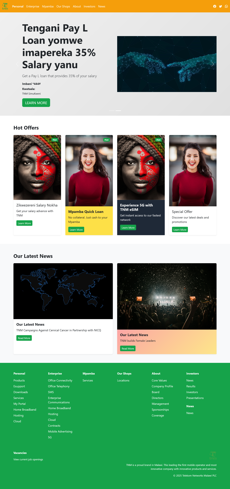
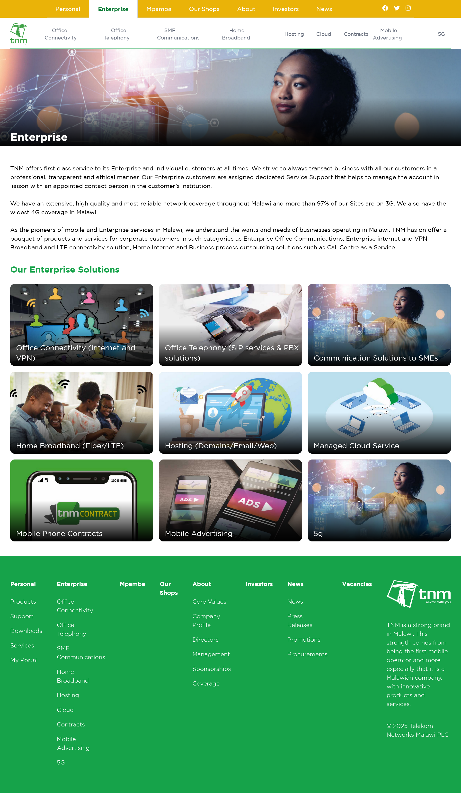
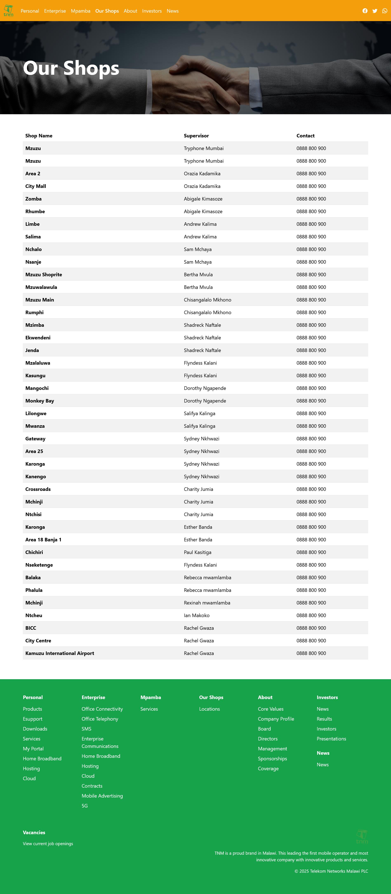

# TNM Clone Website

A static website clone of Telekom Networks Malawi (TNM) built as a school project. This project replicates the design and functionality of TNM's official website, showcasing personal services, enterprise solutions, and retail locations.

## Features

- Responsive design that works on desktop, tablet, and mobile devices
- Multi-page website with smooth navigation
- Interactive carousel showcasing featured promotions
- Service cards highlighting hot offers and latest news
- Accessible design with ARIA labels and semantic HTML
- Social media integration (Facebook, Twitter, WhatsApp)

## Pages

### 1. Personal (index.html)

The main landing page featuring:

- Hero carousel with salary advance and loan promotions
- Hot offers section with service cards
- Latest news and campaigns
- Comprehensive footer with site navigation

### 2. Enterprise (enterprise.html)

Business solutions page showcasing:

- Enterprise services and solutions
- Office connectivity and telephony
- Cloud and hosting services
- 5G network offerings

### 3. Our Shops (our-shops.html)

Retail locations page displaying:

- TNM shop locations across Malawi
- Contact information for each location
- Shop supervisor details

## Screenshots

### Personal Page



### Enterprise Page



### Our Shops Page



## Technologies Used

- HTML5
- CSS3
- Bootstrap 5.3.x
- Bootstrap Icons 1.13.1
- JavaScript (Bootstrap Bundle)

## Project Structure

```
tnm-clone/
├── assets/
│   ├── css/
│   │   ├── bootstrap.min.css
│   │   └── style.css
│   ├── js/
│   │   └── bootstrap.bundle.min.js
│   └── images/
│       ├── tnm-logo.svg
│       ├── favicon.png
│       ├── bg-1.jpg
│       ├── bg-2.jpg
│       ├── bg-3.jpg
│       ├── bg-4.jpg
│       ├── face-1.jpg
│       └── face-2.jpg
├── screenshots/
│   ├── personal.png
│   ├── enterprise.png
│   └── our-shop.png
├── index.html
├── enterprise.html
├── our-shops.html
└── README.md

```

## Getting Started

### Prerequisites

No special prerequisites are needed. You only need a modern web browser to view the website.

### Installation

1. Clone or download this repository

```bash
git clone <repository-url>
cd tnm-clone
```

2. Open the website in your browser

**Option 1: Double-click**

- Simply double-click on `index.html` to open it in your default browser

## Usage

Navigate through the website using the top navigation bar:

- **Personal**: Main page with personal services and offers
- **Enterprise**: Business solutions and enterprise services
- **Mpamba**: Mobile money services (linked)
- **Our Shops**: Retail location finder
- **About**: Company information (linked)
- **Investors**: Investor relations (linked)
- **News**: Latest updates (linked)

## Accessibility Features

- Skip to main content link for keyboard navigation
- ARIA labels for screen readers
- Semantic HTML structure
- Keyboard-friendly navigation
- Alt text for all images

## Browser Support

This website supports all modern browsers:

- Chrome (latest)
- Firefox (latest)
- Safari (latest)
- Edge (latest)

## Acknowledgments

- Design inspired by Telekom Networks Malawi (TNM) official website
- Built using Bootstrap framework
- Icons from Bootstrap Icons
- Created as a school project

## License

This is a school project for educational purposes only. All TNM branding and content belongs to Telekom Networks Malawi PLC.

## Contact

For questions or feedback about this project, please contact the repository owner.
